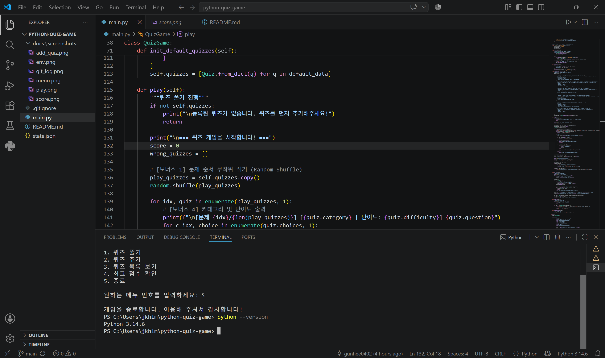
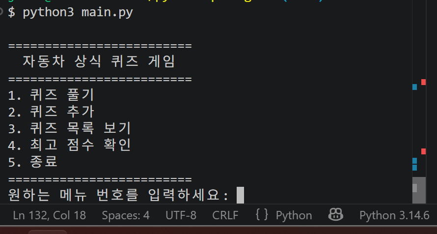
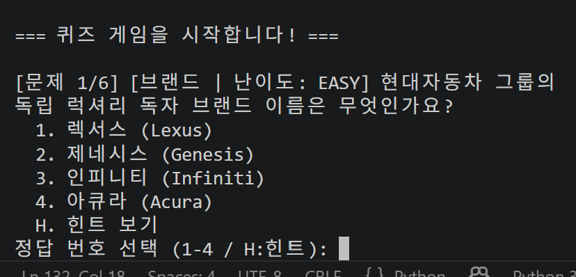
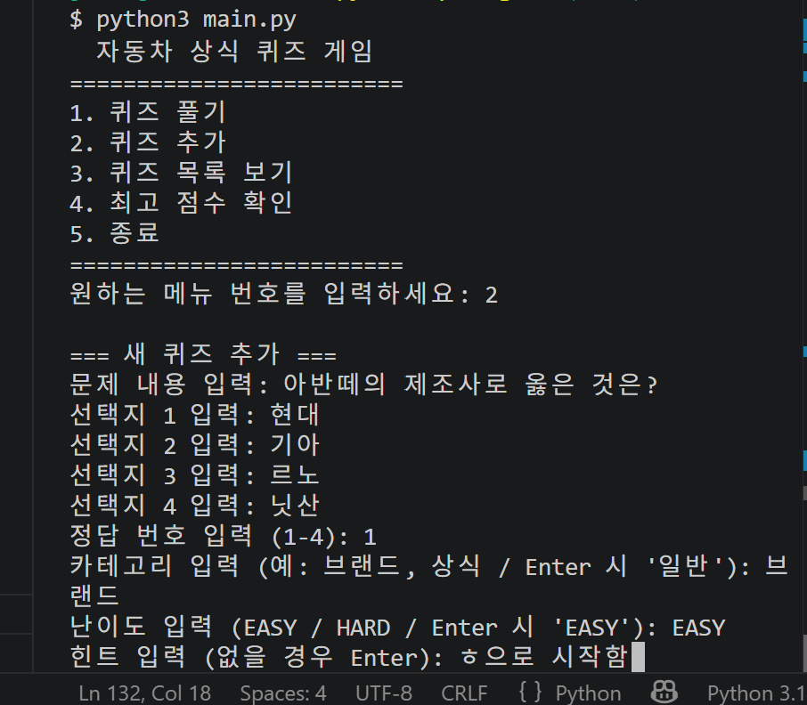
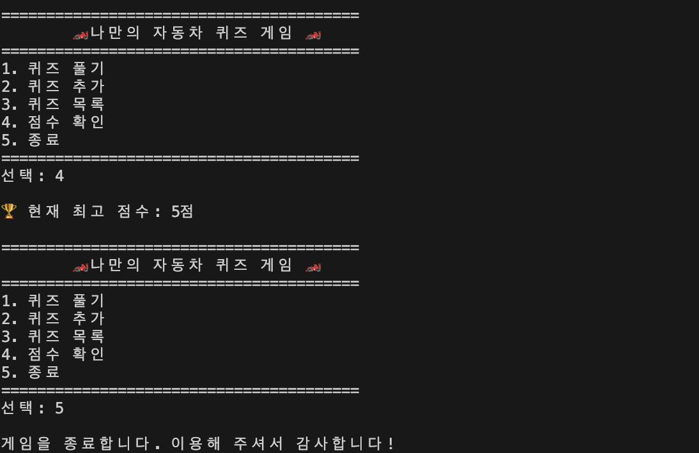
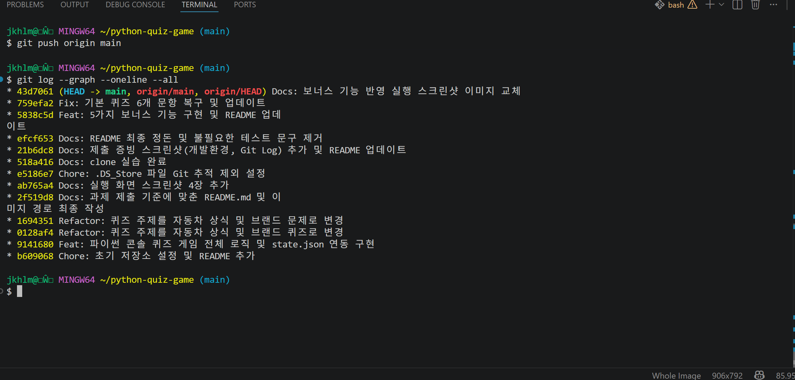

# 파이썬 자동차 상식 콘솔 퀴즈 게임

터미널 환경에서 즐기는 파이썬 기반의 콘솔 퀴즈 게임 프로그램입니다.  

객체지향 프로그래밍(OOP) 개념을 적용하여 `Quiz`와 `QuizGame` 클래스로 구조화하였으며, JSON 파일 저장 방식으로 데이터 영속성을 구현했습니다.

---

## 퀴즈 주제 및 선정 이유
* **주제**: 자동차 상식 및 브랜드/모델 관련 퀴즈
* **선정 이유**: 평소 관심 주제인 자동차를 활용하여 퀴즈를 만드는게 좋을 것 같아서 선정했습니다.

---
## 시스템 구조 및 클래스 설계

### 1. 로직 분리 다이어그램 및 역할
 * **입력 검증 계층**: `input()`으로 사용자 입력을 수신하며, 공백 제거(`strip()`), `isdigit()` 기반 숫자 검증, 범위 검사를 거쳐 예외를 일차 차단합니다.
* **게임 진행 계층**: `QuizGame.play()`, `add_quiz()` 내에서 문제를 출제하고, 정답을 판정하며, 정답률/등급/오답노트 및 힌트를 처리합니다.
* **데이터 영속성 계층**: `save_state()` 및 `load_state()`가 `state.json` 파일 읽기/쓰기를 전담합니다.

### 2. 클래스 책임을 나누고 OOP를 적용한 이유
* **`Quiz` 클래스**: 단일 퀴즈 문항의 속성(질문, 선택지, 정답, 카테고리, 난이도, 힌트)을 **캡슐화**하여 관리합니다.
* **`QuizGame` 클래스**: 퀴즈 목록과 최고 점수를 관리하고, 게임 진행 및 파일 저장/로드의 전반적인 **시스템 제어(Control)**를 담당합니다.
* **함수형 방식 대비 장점**: 단순 함수와 절차적 코드에 비해 데이터와 관련 제어 로직이 객체 단위로 묶여 있어 **코드 재사용성**이 높아지고, 문제 구조 변경 시 `Quiz` 클래스만 수정하면 되므로 **유지보수성**이 극대화됩니다.

---

## 실행 방법

### 1. 개발 환경
* Python 3.10 이상

### 2. 실행 명령어
터미널에서 작업 디렉토리로 이동 후 아래 명령어를 입력합니다.

```bash
python3 main.py
```


## 기능 목록
 1. 퀴즈 풀기: 저장된 퀴즈를 순서대로 풀고 정답 여부를 판별하여 최종 점수를 계산합니다.
 2. 퀴즈 추가: 사용자가 새로운 문제, 4개 선택지, 정답 번호를 직접 등록할 수 있습니다.
 3. 퀴즈 목록: 등록된 전체 퀴즈 문제 목록을 한눈에 조회합니다.
 4. 점수 확인: 게임 종료 후 최고 점수를 기록하고 확인할 수 있습니다.
 5. 데이터 영속성: 퀴즈 및 최고 점수는 state.json 파일로 자동 저장/불러오기됩니다.
 6. 예외 처리: 공통 입력 검증(공백, 문자 입력, 범위 밖 숫자) 및 Ctrl+C 비정상 종료 방지를 지원합니다.
 
 ### 보너스 구현 기능
1. 문제 무작위 출제: `random.shuffle()` 모듈을 활용하여 퀴즈 게임 시작 시 매번 문제 순서를 무작위로 변경.
2. 힌트 보기 시스템: 퀴즈 풀이 중 `H` 키 입력 시 해당 문제에 등록된 힌트 출력.
3. 오답 노트 기능: 게임 완료 후 내가 틀린 문제와 제출했던 답, 정답을 한눈에 복습할 수 있도록 출력.
4. 퀴즈 카테고리 및 난이도 분류: 각 문제마다 카테고리(예: 브랜드, 상식)와 난이도(EASY/HARD) 속성을 추가하고 문제 출력 시 표시.
5. 정답률 계산 및 등급 부여: 최종 결과에서 단순 점수 외에 소수점 1자리 정답률과 판정 등급(A/B/F)을 실시간 산출.


 ## 파일 구조
 ```bash
python-quiz-game/
├── main.py              # 퀴즈 게임 메인 프로그램
├── state.json           # 퀴즈 및 최고 점수 저장 데이터 파일
├── README.md            # 프로젝트 설명서
├── .gitignore           # Git 추적 제외 설정 파일
└── docs/
    └── screenshots/     # 증빙 및 실행 화면 스크린샷 폴더
        ├── add_quiz.png # 퀴즈 추가 스크린샷
        ├── env.png      # 개발 환경 스크린샷
        ├── git_log.png  # Git Log 스크린샷
        ├── menu.png     # 메인 메뉴 스크린샷
        ├── play.png     # 퀴즈 풀기 스크린샷
        └── score.png    # 점수 확인 스크린샷
```
## 데이터 영속성 및 파일 I/O 정책

### 1. JSON 포맷 선택 이유
**가독성과 경량성**: 사람이 읽고 수정하기 쉬운 텍스트 형식이며, 파이썬 기본 'json' 모듈을 활용하여 추가 라이브러리 없이 빠르게 직렬화 및 역직렬화가 가능합니다.

### 2. JSON 스키마 구조 및 설계 의도
```json
{
    "quizzes": [
        {
            "question": "문제 내용",
            "choices": ["선택지1", "선택지2", "선택지3", "선택지4"],
            "answer": 1,
            "category": "브랜드",
            "difficulty": "EASY",
            "hint": "힌트 내용"
        }
    ],
    "best_score": 5
}
 ```

 ## 의도 및 중첩 구조 선택 이유
 최상위 객체에 quizzes 리스트와 best_score 단일 값을 분리 배치하여, 향후 사용자 설정이나 통계 데이터가 추가되어도 스키마 확장이 용이하도록 설계했습니다.

 

## 데이터 파일 설명 (state.json)
프로젝트 루트 경로에 UTF-8 인코딩으로 저장되며, 프로그램 실행 시 자동으로 로드됩니다.

## 파일 I/O 순서, 예외 처리 및 백업, 초기화 방침
로드/저장 순서: 앱 시작 시 load_state() ➔ 데이터 변경(퀴즈 추가, 최고점 갱신, 정상/강제 종료) 시 save_state() 자동 실행.

오류 시 대응 정책 (백업 및 초기화): state.json 파일이 없거나 파일 손상(JSONDecodeError 등) 발생 시 에러 메시지를 출력하고, 기본 퀴즈 6개 문항 데이터로 복구하여 state.json을 새로 재생성 및 자동 백업합니다.

Ctrl+C 강제 종료 자원정리: KeyboardInterrupt 감지 시 메모리에 남아있는 최신 점수 및 상태 데이터를 save_state()로 안전하게 파일에 쓰고 메모리를 정돈한 뒤 정상 종료합니다.

### 예외 처리 및 보완 정책
메인 메뉴 및 종료: 5번 입력 시 및 Ctrl+C 비정상 종료 시 상태 저장과 자원 정리를 완료 후 종료됩니다.

입력 검증 및 재시도 로그: 문자를 입력하거나 범위를 벗어난 숫자 입력 시 경고 메시지 출력 후 올바른 값이 입력될 때까지 무한 루프로 재시도를 유도합니다.

기본 문항 수 변경 방법: QuizGame.init_default_quizzes() 메서드 내부의 default_data 리스트 요소를 수정하거나, 프로그램 메뉴의 2. 퀴즈 추가 기능을 사용하여 손쉽게 문항을 확장할 수 있습니다.

## 4. 시스템 확장성 및 유지보수 가이드

### 1. 주요 코드 변경 포인트

점수/등급 계산 변경: `QuizGame.play()` 메서드 내부의 `grade` 및 `rate` 산출 로직 수정.
퀴즈 속성 추가: `Quiz` 클래스의 `__init__`, `to_dict()`, `from_dict()` 및 `QuizGame.add_quiz()` 입출력 부분 수정.

### 2. 대량 데이터(1000개 이상) 확장 시 예상 병목 및 해결책
병목 원인: 1000개 이상의 문항을 전체 메모리에 로드하고, 데이터 변경 시마다 파일 전체를 JSON으로 다시 쓰는 구조는 I/O 병목 및 메모리 소모를 유발합니다.
대안: 대량 데이터 확장 시에는 JSON 파일 저장 방식에서 **SQLite** 또는 **PostgreSQL**과 같은 RDBMS로 전환하고, 필요한 데이터만 불러오는 페이징(Paging) 및 인덱싱 기법을 도입해야 합니다.

## Git 관리 및 브랜치 전략

### 1. 커밋 단위 규칙 및 메시지 템플릿
커밋단위: 기능 단위로 독립적인 변경 사항만 분리하여 커밋합니다.
메시지 템플릿: 타입-요약 설명, 예를 들어 5가지 보너스 기능 구현, Readme 스크린샷 갱신

### 2. 브랜치 전략 및 병합 의미
main 브랜치: 언제든 배포 가능한 안정적인 주 제품 브랜치.
feature/*브랜치: 단위 기능 개발 전용 브랜치. 기능 개발 완료 후 코드 검토를 거쳐 main 브랜치로 병합합니다.

### JSON 스키마 예시
```bash
{
    "quizzes": [
        {
            "question": "다음 중 이탈리아의 유명 슈퍼카 브랜드가 아닌 곳은?",
            "choices": [
                "페라리 (Ferrari)",
                "람보르기니 (Lamborghini)",
                "포르쉐 (Porsche)",
                "마세라티 (Maserati)"
            ],
            "answer": 3,
            "category": "브랜드",
            "difficulty": "EASY",
            "hint": "독일 슈투트가르트에 본사를 둔 브랜드입니다."
        },
        {
            "question": "세계 최초로 컨베이어 벨트 양산 시스템을 도입하여 대량생산을 시작한 자동차 회사는?",
            "choices": [
                "포드 (Ford)",
                "GM (General Motors)",
                "벤츠 (Mercedes-Benz)",
                "토요타 (Toyota)"
            ],
            "answer": 1,
            "category": "역사",
            "difficulty": "EASY",
            "hint": "모델 T를 제작한 미국 브랜드입니다."
        },
        {
            "question": "현대자동차 그룹의 독립 럭셔리 독자 브랜드 이름은 무엇인가요?",
            "choices": [
                "렉서스 (Lexus)",
                "제네시스 (Genesis)",
                "인피니티 (Infiniti)",
                "아큐라 (Acura)"
            ],
            "answer": 2,
            "category": "브랜드",
            "difficulty": "EASY",
            "hint": "G80, GV80 등을 생산하는 브랜드입니다."
        },
        {
            "question": "전기차 제조사 테슬라(Tesla)의 현 최고경영자(CEO)는 누구인가요?",
            "choices": [
                "빌 게이츠 (Bill Gates)",
                "스티브 잡스 (Steve Jobs)",
                "일론 마스크 (Elon Musk)",
                "제프 베조스 (Jeff Bezos)"
            ],
            "answer": 3,
            "category": "상식",
            "difficulty": "EASY",
            "hint": "스페이스X의 창업자이기도 합니다."
        },
        {
            "question": "독일의 대표 프리미엄 3사(독일 3사)에 속하지 않는 브랜드는?",
            "choices": [
                "메르세데스-벤츠",
                "BMW",
                "아우디",
                "볼보"
            ],
            "answer": 4,
            "category": "브랜드",
            "difficulty": "EASY",
            "hint": "스웨덴 태생의 안전으로 유명한 브랜드입니다."
        },
        {
            "question": "세계에서 가장 빠른 양산차 타이틀을 가졌던 부가티의 대표 모델은?",
            "choices": [
                "베이론 (Veyron)",
                "아벤타도르 (Aventador)",
                "911 GT3",
                "파가니 와이라"
            ],
            "answer": 1,
            "category": "상식",
            "difficulty": "HARD",
            "hint": "이름이 '베'로 시작합니다."
        },
        {
            "question": "아반떼의 제조사로 옳은 것은?",
            "choices": [
                "현대",
                "기아",
                "르노",
                "닛산"
            ],
            "answer": 1,
            "category": "브랜드",
            "difficulty": "EASY",
            "hint": "ㅎ으로 시작함"
        }
    ],
    "best_score": 6
}
```

## 제출 증빙 스크린샷

### 1. 개발 환경 설정


### 2. 프로그램 실행 결과
| 메인 메뉴 | 퀴즈 풀기 |
| :---: | :---: |
|  |  |

| 퀴즈 추가 | 점수 확인 |
| :---: | :---: |
|  |  |

### 3. Git Log 그래프 (`git log --oneline --graph`)
